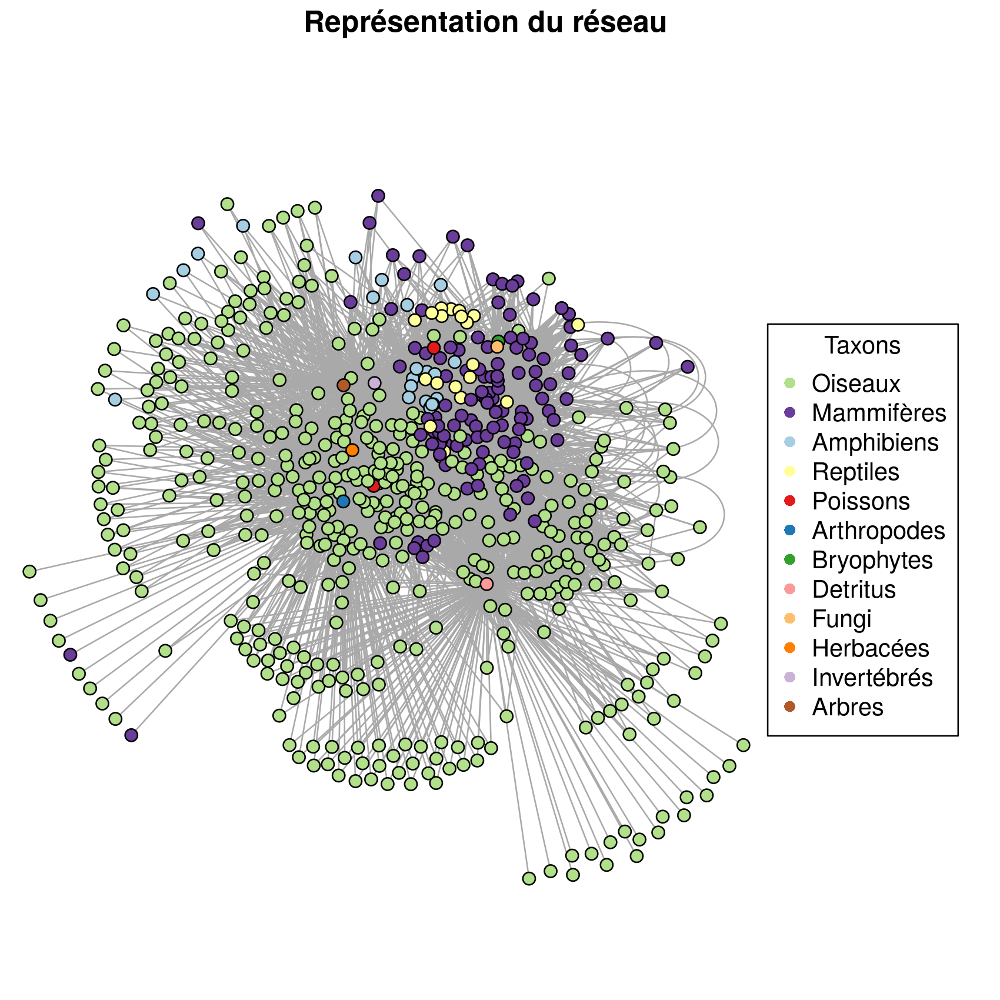
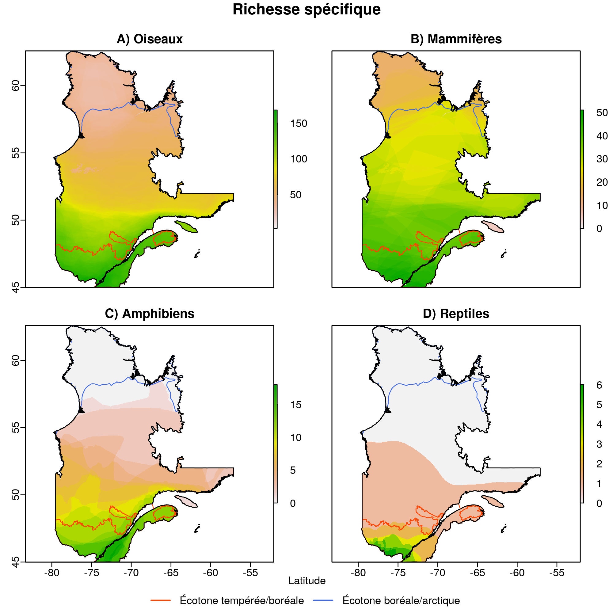
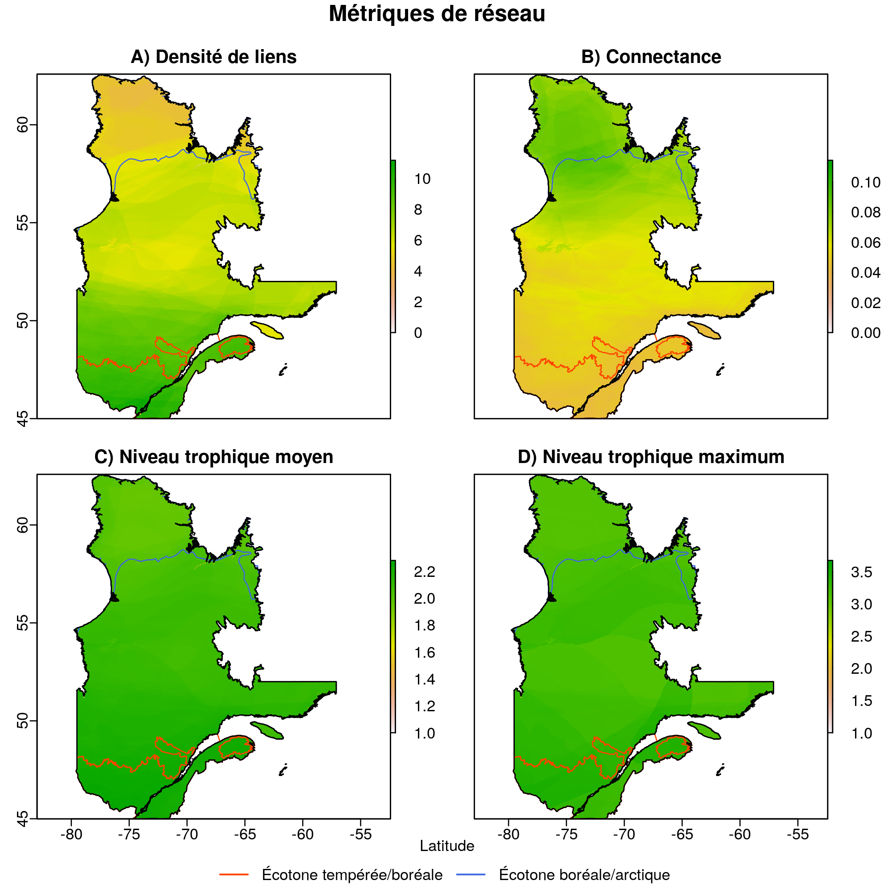
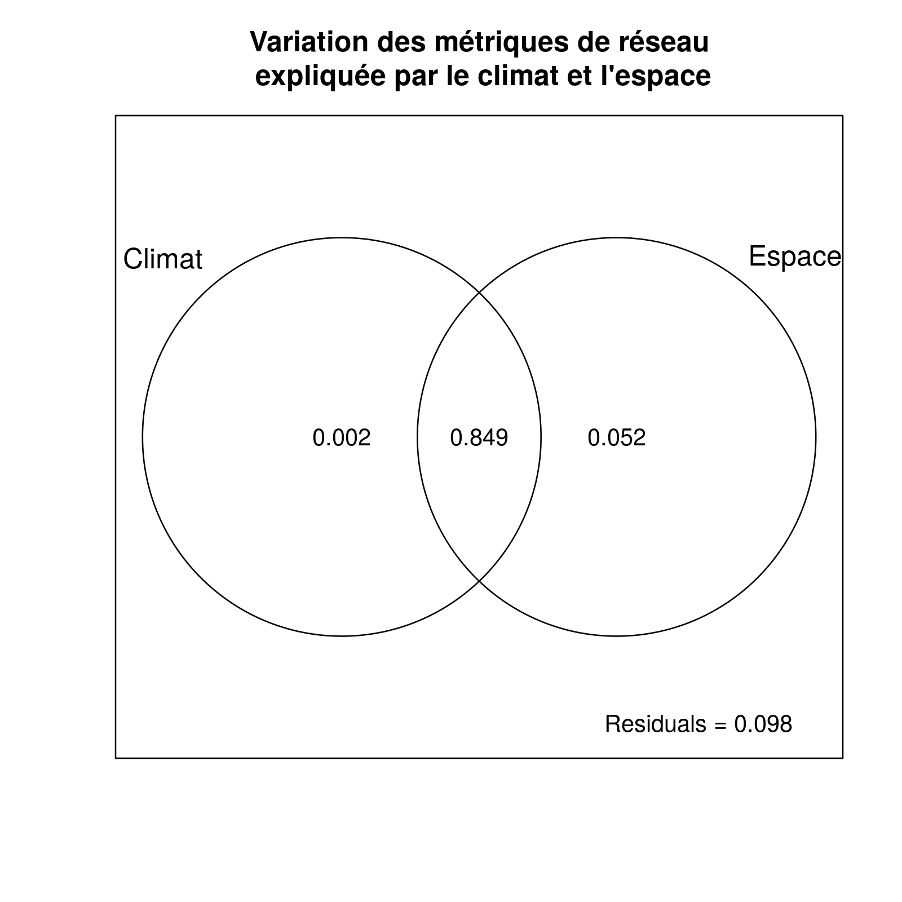
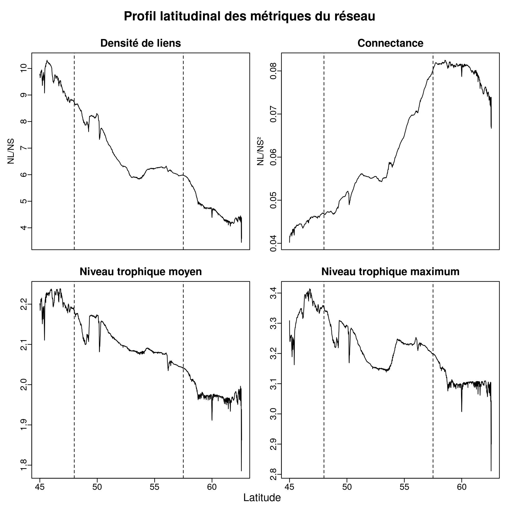

```{r setup, echo = F}
knitr::opts_chunk$set(
  comment = "#",
  #cache = TRUE,
  collapse = TRUE,
  warning = FALSE,
  message = FALSE,
  fig.width = 7,
  fig.height = 5.25,
  fig.align = 'center',
  fig.retina = 3
)
library(readr)
library(kableExtra)
mypar = list(mar = c(3,3,0.5,0.5), mgp = c(1.5, 0.3, 0), tck = -.008)
```

class:  middle, title-slide, 

<div class="my-logo-left"></div>

# Réseaux trophiques  <br> des vertébrés <br> terrestres du <br> Québec

<hr width="45%" align="left" size="0.3" color="#c19a6b"></hr>

## Crédits de recherche <br> ECL618
<br><br>
### Benjamin Mercier, <br>.small[Baccalauréat en écologie]

<i class="fa fa-github fa-lg" style="color:#e7e8e2"></i> [BenMerSci/credits-recherche](https://github.com/BenMerSci/credits-recherche)

---
# Déroulement de la présentation
1. Préambule <br><br>
2. Théorie <br><br>
3. Objectifs et hypothèse <br><br>
4. Méthodologie <br><br>
5. Résultats <br><br>
6. Discussion <br><br>
7. Conclusion <br><br>

---

# Table
<br><br>
```{r comment='', echo=FALSE, results='asis'}
metric_table <- readRDS("images/final_table.RDS")
#metric_table[,c(1:5)] <- round(metric_table[,c(1:5)])
metric_table[,c(1:12)] <- round(metric_table[,c(1:12)], 2)
metric_table <- knitr::kable(metric_table, format = "html", digits = ncol(metric_table), row.names= TRUE, col.names = colnames(metric_table), caption = "TABLE 1: Les métriques du méta-réseau du Québec entier (Général), puis la moyenne selon chaque biome respectif.")
kable_styling(metric_table, font_size = 18) %>%
footnote(general = "NS = Nombre d'espèce, NBasale = Nombre d'espèces basales, NInt = Nombre d'espèces intermédiaires, NTop = Nombre d'espèces supérieures, NL = Nombre de liens, DensL = Densité de liens (NL/NS), C = Connectance (NL/NS²), GenSD = Généralité, VulSD = Vulnérabilité, MoyTR = Niveau trophique moyen, MaxTR = Niveau trophique maximum, Omn = Niveau d'omnivorie.")
```

---

# Représentation réseau
.center[]

---

# Cartes
.center[]

---

# Cartes
.center[]

---

# RDA métriques
.center[]


---

# Profil latitudinal
.center[]

---

# Table test de t
<br><br>
```{r comment='', echo=FALSE, results='asis'}
ttest_table <- readRDS("images/ttest_table.RDS")
rownames(ttest_table) <- c()
ttest_table[,c(2,4,5,6)] <- round(ttest_table[,c(2,4,5,6)], 2)
ttest_table <- knitr::kable(ttest_table, format = "html", digits = ncol(ttest_table), row.names= TRUE, col.names = colnames(ttest_table), caption = "TABLE 2: Comparaison des métriques par biome")
kable_styling(ttest_table, font_size = 18) %>%
pack_rows("Densité de liens (NL/NS)", 1, 3, label_row_css = "background-color: #666; color: #fff;") %>%
pack_rows("Connectance (NL/NS²)", 4, 6, label_row_css = "background-color: #666; color: #fff;") %>%
  collapse_rows(columns = 1, valign = "top") %>%
footnote(general = "t = statistique de t, Ddf = Degrés de liberté")
```

---

class: inverse


# Questions? 


<br>
.pull-left[
**Remerciements**
 - Dominique Gravel
 - Marc Bélisle
 - Guillaume Blanchet
 - Les membres du laboratoire d'écologie intégrative <br>
]

