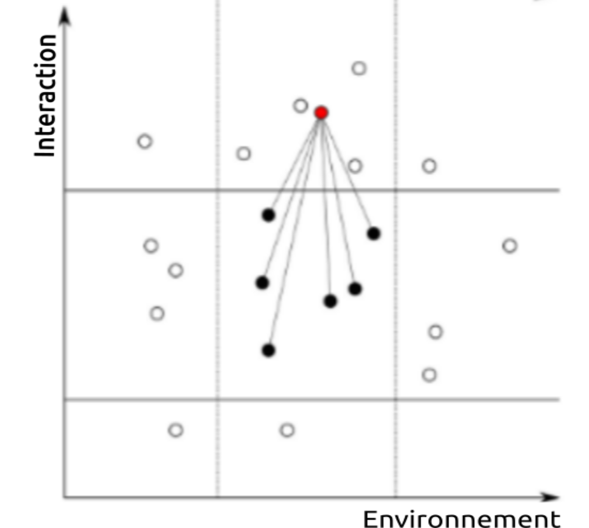
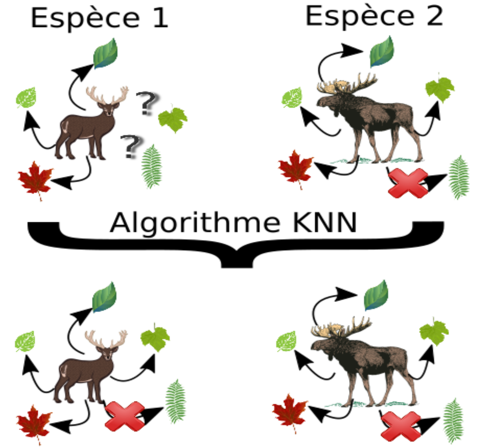

---
output:
  xaringan::moon_reader:
  #  self_contained: TRUE
    includes:
      in_header: conf/style-header.html
    lib_dir: assets
    seal: false
    css: ["conf/css/style.css", "conf/css/fonts.css"]
    nature:
      beforeInit: "conf/style-macros.js"
---

```{r setup, echo = F}
knitr::opts_chunk$set(
  comment = "#",
  #cache = TRUE,
  collapse = TRUE,
  warning = FALSE,
  message = FALSE,
  fig.width = 7,
  fig.height = 5.25,
  fig.align = 'center'
)
mypar = list(mar = c(3,3,0.5,0.5), mgp = c(1.5, 0.3, 0), tck = -.008)
```

class: middle, title-slide

# L&#39;écologie computationnelle

## Réseaux trophiques des vertébrés terrestres du Québec

<br><br><br><br><br>

### Benjamin Mercier, <br> .small[Étudiant au BSc en écologie]

<br><br><br><br><br>
<i class="fa fa-github fa-2x" style="color:#335049"></i> [BenMerSci/CVM_presentation](https://github.com/BenMerSci/CVM_talk)

<i class="fa fa-twitter fa-2x" style="color:#335049"></i> 
[@BenMerSci](https://twitter.com/BenMerSci)

---

class: 
# Déroulement de la présentation <hr/>

 1. Mon cheminement
<br><br>
 2. Qu'est-ce que l'écologie computationnelle ?
<br><br>
 3. Présentation du projet de recherche

.bottom[
.right[

]
]
.tiny[.cite[Icon made by SmartLine from www.flaticon.com]]

---

class: inverse, middle, center
# Mon cheminement

---

# Mon cheminement <hr/>
### Cégep du Vieux Montréal .tiny[(2013-2016)]
- Pré-universitaire en Sciences de la nature

### Université de Sherbrooke .tiny[(2016-2020)]
- Baccalauréat en écologie
<h2>
- Microprogramme en écologie pratique
<h2>
- Divers stages en milieu académique (recherche)

.middle[
.right[

]
]

---

class: inverse, middle, center
#Qu'est-ce que l'écologie computationnelle?

---

# Historique <hr/>
.pull-left[
- Longtemps une discipline descriptive et conceptuelle
<h2>
- Développement et application de statistiques (1930)
<h2>
- Développement et applications de théories mathématiques (1960)
<h2>
- Expériences terrains coûteuses et laborieuses
<h2>
- Accumulation massive de données et meilleurs ordinateurs

]
.pull-right[

]

---

# Définition <hr/>
<br><br><br>
.center[ 
.Large[***"L'utilisation combinée d'algorithmes, de programmes et de bonnes pratiques de gestion de données dans le but de résoudre des problèmes complexes." ***]
<br><br><br>
**L'écologie computationnelle est donc l'application de ces outils à des problèmes écologiques complexes**
]
.tiny[.cite[Poisot, T., LaBrie, R., Larson, E., Rahlin, A., & Simmons, B. I. [2019.](https://pdfs.semanticscholar.org/0e7b/c4ce649a00edeb110bec864ccfd7c003ce7a.pdf), IEE.]]

---

# Quelques exemples d'application <hr/>
###1) Modélisation de la migration de la forêt
- État initial de chaque parcelle de la forêt (T, B, M, R) <h2>
- Probabilité de changer d'état selon l'environnement et ses "voisins"
.center[
.bottom[

]
]

---

# Quelques exemples d'application <hr/>
###1) Modélisation de la migration de la forêt
.center[

]
<br><br>
.tiny[.cite[Vissault, S. [2016.](http://semaphore.uqar.ca/1266/) Diss. Université du Québec à Rimouski]]

---

# Quelques exemples d'application <hr/>
###2) Les écosystèmes marins
- Impossible d'échantillonner les réseaux marins empiriquement
<h2>
- Reconstituer les interactions en combinant des données massives et certaines suppositions
.middle[
.center[

]
]
.tiny[.cite[Albouy, C. et al. [2019.](https://www.nature.com/articles/s41559-019-0950-y) Nature ecology & evolution, .3(8), 1153-1161.]]

---

class: inverse, middle, center
#Reconstitution des réseaux trophiques des vertébrés terrestres

---

# Tables des matières <hr/>

.pull-left[ 
1) Préambule <br><br>
2) Théorie sous-jacente  <br><br>
3) Objectifs et hypothèse <br><br>
4) Méthodologie <br><br>
5) Bibliographie <br><br>
]

---

# Préambule <hr/>
## Écologie
.large[**Définition:**]
<br><br>
.center[
.Large[
***L'Étude des organismes vivants dans leur environnement; les interactions avec les paramètres biotiques et abiotiques.***
]
]
<br><br>
**.center[.large[La représentation en réseau de ce type de système permet d'interpreter la diffusion des perturbations]]**
---

# Préambule <hr/>
## Réseau trophique
.center[]
.tiny[.cite[https://lamaisondalzaz.wordpress.com/la-foret-son-role-vu-par-les-citoyens/la-foret-de-la-chaine-alimentaire-au-transfert-de-matiere/]]

---

# Préambule (suite) <hr/>
## Services écosystémiques
- Services écosystémiques découlent des interactions présentent dans les réseaux trophiques [1, 2, 3]
<br><br><br>
.pull-left[]
.pull-right[]

---

# Préambule <hr/>
## Cascade trophique

.pull-left[

<br><br>
&nbsp;&nbsp;&nbsp;&nbsp;&nbsp;&nbsp;&nbsp;&nbsp;&nbsp;**changements globaux**
<br><br>
&nbsp;&nbsp;&nbsp;&nbsp;&nbsp;&nbsp;&nbsp;&nbsp;&nbsp;&nbsp;&nbsp;&nbsp;&nbsp;&nbsp;&nbsp;&nbsp;&nbsp;&nbsp;&nbsp;&nbsp;&nbsp;&nbsp;&nbsp;&nbsp;&nbsp;&nbsp;&nbsp; .Large[&darr;]
<br><br>
&nbsp;&nbsp;&nbsp;&nbsp;&nbsp;&nbsp;Perte de gros organismes et &nbsp;&nbsp;&nbsp;&nbsp;&nbsp;&nbsp;cascasdes trophiques [3, 4, 5]
]
.pull-right[

]
.tiny[.cite[https://www.tes.com/lessons/_gRvCApIQBLPWg/aaa-biodiversity-trophic-cascades]]

---

# Préambule (suite) <hr/>
## Enveloppe climatique
- Conditions environnementales optimales pour prospérer
- Migration et déplacement/modification des réseaux trophiques
.center[]

---

# Préambule (suite) <hr/>
<br><br><br><br><br><br>
.center[.Large[**Il est donc primordiale d'exposer la structure de base de nos présents réseaux écologiques pour en prévoir les variations et conséquences associées!**]]

---

# Théorie <hr/>
## La niche écologique
- Disitribution spatiale dépend de l'environnement [6]
<h2>
- Quantification de cette niche selon Hutchinson [7]
<h2>
- Chaque variable environnementale est un axe &rarr; ***hypervolume***
<br><br><br><br>
.center[.Large[***Ceci est la niche écologique fondamentale***]]

---

# Théorie (suite) <hr/>
## La niche écologique


.center[***Représentation 2D (A) et 3D (B) de la niche fondamentale***]

---

# Théorie (suite) <hr/>
## La niche écologique 
- Intrégrer l'effet d'autres espèces
<h2>
- Modification de "l'hypervolume"
<h2>
- Variation spatiale et temporelle possible de la niche
<br><br><br><br><br>
.center[.Large[***Ceci est la niche écologique réalisée***]]

---

# Théorie (suite) <hr/>
## La niche d'interactions 
- Disitribution spatiale dépend des interactions biotiques [8]
<br><br>
- Interactions nécessitent une correspondance de caractéristiques <br><br>
  **exemple:** ouverture de bouche suffisament large pour une grosse proie
  <h2>

---

# Théorie (suite) <hr/>
## La niche intégrée
.pull-left[
- Combinaison de la niche écologique et de la niche d'interactions
<h2>
- Distribution spatiale dépend de l'environnement et des interactions biotiques
]
.pull-right[]
.tiny[.cite[Adapté de : Gravel, D., Baiser, B., Dunne, J. A., Kopelke, J. P., Martinez, N. D., Nyman, T., ... & Roslin, T. [2019.](https://onlinelibrary.wiley.com/doi/full/10.1111/ecog.04006)  Ecography.]]

---

# Théorie (suite) <hr/>
## Limites taxonomiques respectives
### Mammifères
- Équilibre énergétique pour la chaleur corporelle [9]
<h2>
- Effets variables des microconditions environnementales [10]

### Oiseaux
- Équilibre énergétique pour la chaleur corporelle
<h2>
- Structure verticale de l'environnement [11, 12, 13]

---

# Théorie (suite) <hr/>
## Limites taxonomiques respectives
### Amphibiens
- Température [14]
- Disponibilité de l'eau [15, 16]

### Reptiles
- Température [16]
- Disponibilité de l'eau [16]

---

# Objectifs et hypothèse <hr/>
## Objectifs
- Reconstituer le réseau trophique des vertébrés terrestres
<h2>
- Illustrer spatialement ces réseaux sur le territoire du Québec
<h2>
- Comprendre ce qui structure ces différents réseaux

## Hypothèse
- La complexité des réseaux trophiques diminuera à l'écotone entre la forêt boréale et la tundra.

---
  
# Méthodologie <hr/>
.pull-left[
1. Regrouper et formatter les données de bases en un méta-réseau
<h2>
2. Reconstituer les réseaux trophiques
<h2>
3. Illustrer spatialement les réseaux sur le territoire du Québec
<h2>
4. Analyse des caractéristiques du réseau
]
.pull-right[
<br><br><br><br><br><br><br><br><br><br>

]
.tiny[.cite[Adapted, icon made by Freepik from www.flaticon.com]]

---

# Méthodologie <hr/>
## Regrouper et formatter les données de base
- Jeux de données représentatifs de l'ensemble du Québec
<h2>
- Formatage essentiel des données
<h2>
- Résulte en un méta-réseau
.center[]

---

# Méthodologie <hr/>
## Regrouper et formatter les données de base
- Jeux de données représentatifs de l'ensemble du Québec
<h2>
- Formatage essentiel des données
<h2>
- Résulte en un méta-réseau

---

# Méthodologie <hr/>
## Reconstituer le méta-réseau avec l'algorithme KNN
- **KNN:** K plus proches voisins (K-Nearest-Neighbor)
- Nécessite initialement une matrice d'interaction 
.center[]
<br>

---

# Méthodologie <hr/>
## Reconstituer le méta-réseau avec l'algorithme KNN
.pull-left[- Même principe que les propositions Netflix, Amazon et Youtube]
.center[]
.tiny[.cite[Desjardins-Proulx, P., Laigle, I., Poisot, T., & Gravel, D. [2017.](https://peerj.com/articles/3644/) PeerJ, 5, e3644.]]
---

# Méthodologie <hr/>
## Reconstituer le méta-réseau avec l'algorithme KNN
- Mesure de distance entre chaque paire d'espèces
<br><br><br>
$$Jaccard_d = \frac{a}{(a+b+c)}$$
.pull-right[]

---

# Méthodologie <hr/>
## Illustrer spatialement le méta-réseau

- Se procurer les cartes de distribution d'espèce
<h2>
- Transformer la carte en grille
<h2>
- Limiter les interactions avec les co-occurences d'espèces

---

# Méthodologie <hr/>
## Illustrer spatialement le méta-réseau
.pull-left[]
.pull-right[]

---
# Méthodologie <hr/>
## Illustrer spatialement le méta-réseau

.pull-left[]
.pull-right[]

---

# Méthodologie <hr/>
## Analyse des caractéristiques du réseau
- Nombre d'espèces (S)
<h2>
- Nombre de liens (L)
<h2>
- Connectance (L/S²)
<h2>
- Modularité
.pull-right[]

<br><br><br><br><br><br>
.center[.large[**Explorer la variation de ces caractéristiques sur l'ensemble du territoire du Québec**]]
.tiny[.cite[Dunne, J. A., Williams, R. J., Martinez, N. D., Wood, R. A., & Erwin, D. H. [2008.](https://journals.plos.org/plosbiology/article?id=10.1371/journal.pbio.0060102) PLoS biology, 6(4).]]

---

# Utilité ? <hr/>

- Exposer une structure initial en guise de référence
<h2>
- Parler de biodiversité (changements climatiques abordés 8x plus)
<h2>
- Pourquoi pas?

.tiny[.cite[Legagneux, P., Casajus, N., Cazelles, K., Chevallier, C., Chevrinais, M., Guéry, L., ... & Ropars, P. [2018.](https://www.frontiersin.org/articles/10.3389/fevo.2017.00175/full?source=post_page---------------------------) Frontiers in Ecology and Evolution, 5, 175.]]
---

# Bibliographie <hr/>

.tiny[ 
1. Daily, G. C., S. Alexander, P. R. Ehrlich, L. Goulder, P. A. Matson, H. A. Mooney, S. Postel, H. Schneider, D. Tilman & G. M. Woodwell, 1997. Ecosystem services: Benefits Supplied to Human Societies by Natural Ecosystems. Ecological Society of America: 21.
2. Duffy, J. E., 2009. Why biodiversity is important to the functioning of real-world ecosystems. Frontiers in Ecology and the Environment, 7: 437–444.
3. Jordano, P., 2016. Chasing Ecological Interactions. PLOS Biology, 14: e1002559.
4. Estes, J. A., J. Terborgh, J. S. Brashares, M. E. Power, J. Berger, W. J. Bond, S. R. Carpenter, T. E. Essington, R. D. Holt, J. B. C. Jackson, R. J. Marquis, L. Oksanen, T. Oksanen, R. T. Paine, E. K. Pikitch, W. J. Ripple, S. A. Sandin, M. Scheffer, T. W. Schoener, J. B. Shurin, A. R. E. Sinclair, M. E. Soulé, R. Virtanen & D. A. Wardle, 2011. Trophic Downgrading of Planet Earth. Science, 333: 301–306.
5. Montoya, J. M. & D. Raffaelli, 2010. Climate change, biotic interactions and ecosystem services. Philosophical Transactions of the Royal Society B: Biological Sciences, 365: 2013–2018.
6. Grinnell, J., 1917. The Niche-Relationships of the California Thrasher. The Auk, 34: 427–433.
7. Hutchinson, G. E., 1957. Concluding Remarks. Cold Spring Harbor Symposia on Quantitative Biology, 22: 415–427.
8. Elton, C. S. (Charles S., 1927. Animal ecology. New York, Macmillan Co.
9. Genoways, H. H. (Ed.), 1987. Current Mammalogy: Volume 1. Springer US.
10. Masini, F. & B. Sala, 2007. Large- and small-mammal distribution patterns and chronostratigraphic boundaries from the Late Pliocene to the Middle Pleistocene of the Italian peninsula. Quaternary International, 160: 43–56.
11. MacArthur, R., H. Recher & M. Cody, 1966. On the Relation between Habitat Selection and Species Diversity. The American Naturalist, 100: 319–332.
12. Brokaw, N. V. L. & R. A. Lent, 1999. Vertical structure. Pages 373–399 Maintaining Biodiversity in Forest Ecosystems. Cambridge: Cambridge University Press.
13. Culbert, P. D., V. C. Radeloff, C. H. Flather, J. M. Kellndorfer, C. D. Rittenhouse & A. M. Pidgeon, 2013. The Influence of Vertical and Horizontal Habitat Structure on Nationwide Patterns of Avian BiodiversityLa Influencia de la Estructura Vertical y Horizontal del Hábitat en los Patrones de Diversidad de Aves a Escala Nacional. The Auk, 130: 656–665.
14. P. S. Corn, 2007. Climate change and amphibians. Animal Biodiversity and Conservation, 28.
15. Hecnar, S. & R. M’Closkey, 1996. Amphibian species richness and distribution in relation to pond water chemistry in south‐western Ontario, Canada. Freshwater Biology, 36: 7–15.
16. Porter, K. R., 1972. Herpetology. Philadelphia, PA : Saunders.
]

---

class: inverse

.center[.huge[**Questions?**]]

<br><br>
.left[
**Remerciements**

- Spécialement Willian Vieira
<h2>
- Guillaume Blanchet
<h2>
- Dominique Gravel
<h2>
- Laboratoire d'écologie intégrative
]

.pull-right1[
<br>
<br>

]