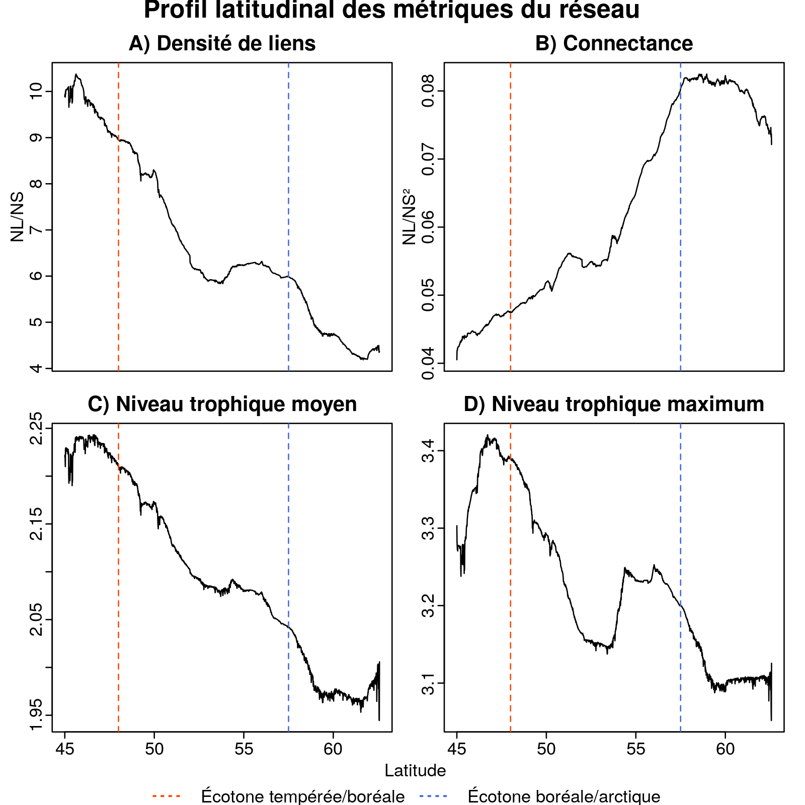

```{r setup, echo = F}
knitr::opts_chunk$set(
  comment = "#",
  #cache = TRUE,
  collapse = TRUE,
  warning = FALSE,
  message = FALSE,
  fig.width = 7,
  fig.height = 5.25,
  fig.align = 'center',
  fig.retina = 3
)
library(readr)
library(kableExtra)
mypar = list(mar = c(3,3,0.5,0.5), mgp = c(1.5, 0.3, 0), tck = -.008)
```

class:  middle, title-slide, 

<div class="my-logo-left"></div>

# Réseaux trophiques  <br> des vertébrés <br> terrestres du <br> Québec

<hr width="45%" align="left" size="0.3" color="#FFFACD"></hr>

## Crédits de recherche <br> ECL618
<br><br>
### Benjamin Mercier, <br>.small[Baccalauréat en écologie]

---

class: inverse
<br><br><br><br><br><br>
.center[.font180[**Introduction**]]

---

# Préambule et théorie

- Services écosystémiques découlent des interactions entre espèces .font50[(Daily et al. (1997); Duffy (2009); Jordano (2016))] <br><br>
- Réseaux trophiques avec plus d'espèces sont plus productifs .font50[(Duffy (2009); Duffy et al. (2007))]<br><br>
- Interactions composants les réseaux non-aléatoires .font50[(Jordano (2016))] <br><br><br><br>
.center[]

---

# Préambule et théorie (suite)

- Impacts des changements globaux sur les écosystèmes .font50[(Estes et al. (2011); Montoya & Raffaelli (2010))]<br><br>
- Changements spatiaux des "enveloppes climatiques" .font50[(Walther et al. (2002); Montoya & Raffaelli (2010))]<br><br>
- Affecte les hauts de chaînes trophiques .font50[(Estes et al. (2011))]<br><br>

.center[**Principaux affectés**]<br><br>
.center[]

---

# Préambule et théorie (suite)
.pull-left[
- Reconstitution basée sur la théorie de la niche intégrée<br> .font50[(Gravel et al. (2019))] <br><br><br>

.center[Distribution des espèces]
.center[.font150[&darr;]]
.center[Interactions<br>.font50[(Elton (1927))]]
.center[+]
.center[environnement<br>.font50[(Grinnell (1917))]]
]
<br><br><br><br><br><br>
.pull-rifght[
]

.cite[.font70[Adapté de Gravel et al. (2019)]]
---

# Objectifs et hypothèse
<p class="box"><br>.center[**Reconstituer les réseaux trophiques des vertébrés terrestres du Québec**]<br></p>
1. .font90[Obtenir une image temporelle servant de comparaison pour les années à venir] <br><br>
2. .font90[Explorer les conséquences des variations de biodiversité à large échelle spatiale sur la structure et le fonctionnement des réseaux écologiques du Québec.]
<br><br><br>
.center[.font110[**Hypothèse**]]
.center[Les métriques de réseaux trophiques varient le long du gradient climatiques Sud-Nord]

---

class: inverse
<br><br><br><br><br><br>
.center[.font180[**Méthodologie**]]

---

# Méthodologie
.center[**Schéma explicatif**]
.center[]
.cite[.font70[Icons made by "https://www.flaticon.com/authors/vitaly-gorbachev"]]

---

# Méthodologie (étape 1)
.center[]
- Corrections taxonomiques limitants le doublons 
- Taxons factices pour les non-vertébrés<br><br>

.center[.font110[**Sortant**]]
.pull-right[&nbsp;&nbsp;&nbsp;&nbsp;&nbsp;&nbsp;&nbsp;&nbsp;&nbsp;&nbsp;&nbsp;&nbsp;&nbsp;&nbsp;&nbsp;&nbsp;&nbsp;&nbsp;&nbsp;&nbsp;&nbsp;]
.pull-left[
**Matrice d'interaction non-inférée**
- 1 = interaction
- 0 = pas d'interaction
- NA = Inconnu / à inférer
]

---

# Méthodologie (étape 2)
.center[]

- Inférence des interactions comme les recommandations Netflix .font50[(Desjardins et al. (2017))]
- Inférence basée sur une mesure de distance <br><br>

.center[.font110[**Sortant**]]
.pull-right[&nbsp;&nbsp;&nbsp;&nbsp;&nbsp;&nbsp;&nbsp;&nbsp;&nbsp;&nbsp;&nbsp;&nbsp;&nbsp;&nbsp;&nbsp;&nbsp;&nbsp;&nbsp;&nbsp;&nbsp;&nbsp;]
.pull-left[
**Matrice d'interaction _inférée_**
- Moins de NAs
]

---

# Algorithme KNN - Fonctionnement
.center[**Exemple: k = 1**]
.center[]
<br>
.center[**Projet: k = 5**]

---

# Algorithme KNN - Matrices de distance
.pull-left[
**1. Matrice de distance de diète** .font50[(Vegan (2019), R package version 2.5-6.)]<br>
- Matrice carrée de dimension _627x627_
- Distance de similarité de diète
]
.pull-right[.center[
$Jaccard_d = \frac{a}{(a+b+c)}$<br><br>
]]<br>

.pull-left[
**2. Matrice de distance phylogénétique** .font50[Vegan (2019), R package version 2.5-6.)]
- Matrice carrée de dimension _627x627_
- "Distance taxonomique moyenne" entre chaque espèce .font50[(Clarke & Warwick (1998))]
]

---

# Algorithme KNN - Matrices de distance
- Matrice de distance final - **deux scénarios:**<br>

1. Si la diète est connue :<br><br>
$M_{dist}= (0.8 * M_{diète}) + (0.2 * M_{phylogénie})$
<br><br>
2. Si la diète est inconnue (NA) :<br><br>
$M_{dist}= (0 * M_{diète}) + (1 * M_{phylogénie})$
<br><br>

<p class="box"><br>.center[**Diète davantage représentatrice des interactions**]<br></p>

---

# Méthodologie (étape 3)
.center[]

- Cartes de distribution pour 390 espèces<br><br>
- Taxons factices non-limitants<br><br>
- Rasterisation des cartes de distribution<br><br>

---

# Méthodologie (étape 3)
<br>
.pull-left[
**Expliciter**
- Sous-matrice d'interaction/cellule
- Calcul des métriques par cellule/biome<br><br><br><br>
.left[**Effet du climat et de l'espace**]
- Effet présent?
- Si oui, comment varient-ils?
]

.pull-right[
<br><br><br>

]

---

class: inverse
<br><br><br><br><br><br>
.center[.font180[**Résultats - Discussion**]]

---

# Résultats - Réseau
.center[]

---

# Résultats - Cartes
.center[]

---

# Résultats - Métriques
- Semble avoir une variation dans les métriques selon le biome
<br><br>
```{r comment='', echo=FALSE, results='asis'}
metric_table <- readRDS("images/final_table_corrected.RDS")
metric_table <- metric_table[,c(1,6,7,10,11)]
#metric_table[,c(1:5)] <- round(metric_table[,c(1:5)])
metric_table[,c(1:5)] <- round(metric_table[,c(1:5)], 2)
metric_table <- knitr::kable(metric_table, format = "html", digits = ncol(metric_table), row.names= TRUE, col.names = colnames(metric_table), caption = "TABLE 1: Les métriques du méta-réseau du Québec, puis la moyenne selon chaque biome respectif.")
kable_styling(metric_table, font_size = 18) %>%
footnote(general = "NS = Nombre d'espèce, NL = Nombre de liens, DensL = Densité de liens (NL/NS), C = Connectance (NL/NS²), MoyTR = Niveau trophique moyen, MaxTR = Niveau trophique maximum.")
```

---

# Cartes - Métriques
.center[]

---

# Variation selon climat/espace

.pull-left[]


.pull-right[]


---

# Profil latitudinal
.center[]

---

# Discussion
.center[**Limitations taxonomiques respectives selon les taxons**]<br><br><br>
.center[]

---

# Discussion
- Perte de structure 3D = perte d'espèces et donc de liens .font50[(Germano & Lawhead (1986); Brokaw, & Lent (1999); MacArthur et al. (1966); Karr (1968); Culbert et al. (2013))]<br><br><br><br>
**Biais**<br>
- Co-existance = interaction? .font50[(Poisto et al. (2015))]<br><br>
- Reconstitution dépend ultimement des interactions de base<br><br>
- Interactions spécialistes non présentes?
---

# Amélioration et optimisation
- Raffiner la taxonomie<br><br><br>
- Optimiser l'algorithme KNN<br><br><br>
- Intégrer la notion de traits d'espèce<br><br><br>
- Trouver davantage de cartes de distribution<br><br>

---

# Conclusion
.center[**Objectif principal**]<br><br>
.center[Reconstitution des réseaux trophiques semble possible]
<br><br><br>
.center[**Hypothèse**]<br><br>
.center[Les métriques de réseaux, donc la structure, varient le long du gradient climatique Sud-Nord]<br><br>
.center[Effets du climat et de l'espace qui sont fortement corrélés]


---

# Références
.font60[
- Brokaw, N. V. L. & R. A. Lent, 1999. Vertical structure. Pages 373–399 Maintaining Biodiversity in Forest Ecosystems. Cambridge: Cambridge University Press.<br>
- Clarke, K. and Warwick, R. (1998). A taxonomic distinctness index and its statistical properties.
Journal of applied ecology, 35(4) :523–531.<br>
- Culbert, P. D., V. C. Radeloff, C. H. Flather, J. M. Kellndorfer, C. D. Rittenhouse & A. M. Pidgeon, 2013. The Influence of Vertical and Horizontal Habitat Structure on Nationwide Patterns of Avian BiodiversityLa Influencia de la Estructura Vertical y Horizontal del Hábitat en los Patrones de Diversidad de Aves a Escala Nacional. The Auk, 130: 656–665.<br>
- Daily, G. C., S. Alexander, P. R. Ehrlich, L. Goulder, P. A. Matson, H. A. Mooney, S. Postel, H. Schneider, D. Tilman & G. M. Woodwell, 1997. Ecosystem services: Benefits Supplied to Human Societies by Natural Ecosystems. Ecological Society of America: 21.<br>    Desjardins-Proulx, P., I. Laigle, T. Poisot & D. Gravel, 2017. Ecological interactions and the Netflix problem. PeerJ, 5: e3644.<br>
- Duffy, J. E., Cardinale, B. J., France, K. E., McIntyre, P. B., Thébault, E., & Loreau, M. (2007). The functional role of biodiversity in ecosystems: incorporating trophic complexity. Ecology letters, 10(6), 522-538.<br>
- Duffy, J. E., 2009. Why biodiversity is important to the functioning of real-world ecosystems. Frontiers in Ecology and the Environment, 7: 437–444.<br>
- Elton, C. S. (Charles S., 1927. Animal ecology. New York, Macmillan Co.<br>
- Estes, J. A., J. Terborgh, J. S. Brashares, M. E. Power, J. Berger, W. J. Bond, S. R. Carpenter, T. E. Essington, R. D. Holt, J. B. C. Jackson, R. J. Marquis, L. Oksanen, T. Oksanen, R. T. Paine, E. K. Pikitch, W. J. Ripple, S. A. Sandin, M. Scheffer, T. W. Schoener, J. B. Shurin, A. R. E. Sinclair, M. E. Soulé, R. Virtanen & D. A. Wardle, 2011. Trophic Downgrading of Planet Earth. Science, 333: 301–306.<br>
- Germano, D. J. & D. N. Lawhead, 1986. Species diversity and habitat complexity: Does vegetation organize vertebrate communities in the Great Basin? The Great Basin Naturalist, 46: 711–720.<br>
- Grinnell, J., 1917. The Niche-Relationships of the California Thrasher. The Auk, 34: 427–433.<br>
- Jari Oksanen, F. Guillaume Blanchet, Michael Friendly, Roeland Kindt, Pierre Legendre, Dan McGlinn, Peter
    R. Minchin, R. B. O'Hara, Gavin L. Simpson, Peter Solymos, M. Henry H. Stevens, Eduard Szoecs and Helene
    Wagner (2019). vegan: Community Ecology Package. R package version 2.5-6.
    https://CRAN.R-project.org/package=vegan<br>
- Jordano, P., 2016. Chasing Ecological Interactions. PLOS Biology, 14: e1002559.<br>
- Karr, J. R., 1968. Habitat and Avian Diversity on Strip-Mined Land in East-Central Illinois. The Condor, 70: 348–357.<br<
]

---

.font60[
 - MacArthur, R., H. Recher & M. Cody, 1966. On the Relation between Habitat Selection and Species Diversity. The American Naturalist, 100: 319–332.<br>
- Montoya, J. M. & D. Raffaelli, 2010. Climate change, biotic interactions and ecosystem services. Philosophical Transactions of the Royal Society B: Biological Sciences, 365: 2013–2018.<br>
- Poisot, T., D. B. Stouffer & D. Gravel, 2015. Beyond species: why ecological interaction networks vary through space and time. Oikos, 124: 243–251.<br<
- Walther, G.-R., E. Post, P. Convey, A. Menzel, C. Parmesan, T. J. C. Beebee, J.-M. Fromentin, O. Hoegh-Guldberg & F. Bairlein, 2002. Ecological responses to recent climate change. Nature, 416: 389–395.<br>
]

---

class: inverse

.pull-left[
.font150[**Remerciements**]
 - Dominique Gravel
 - Marc Bélisle
 - Guillaume Blanchet
 - Les membres du laboratoire d'écologie intégrative <br>
]

