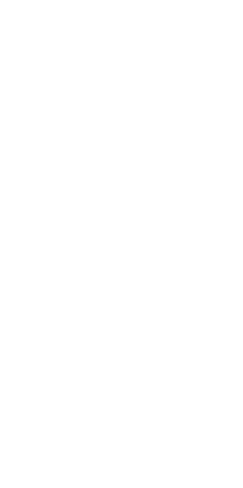

```{r setup, echo = F}
knitr::opts_chunk$set(
  comment = "#",
  #cache = TRUE,
  collapse = TRUE,
  warning = FALSE,
  message = FALSE,
  fig.width = 7,
  fig.height = 5.25,
  fig.align = 'center',
  fig.retina = 3
)

mypar = list(mar = c(3,3,0.5,0.5), mgp = c(1.5, 0.3, 0), tck = -.008)
```

class: notitle, middle, title-slide, 

<div class="my-logo-left"></div>

# Réseaux trophiques  <br> des vertébrés <br> terrestres du <br> Québec

<hr width="45%" align="left" size="0.3" color="orange"></hr>

## Crédits de recherche <br> ECL618

### Benjamin Mercier, <br>.small[Baccalauréat en écologie]
<br>
<i class="fa fa-github fa-lg" style="color:#e7e8e2"></i> [BenMerSci/credits-recherche](https://github.com/BenMerSci/credits-recherche)

<i class="fa fa-twitter fa-lg" style="color:#e7e8e2"></i> [@BenMerSci](https://twitter.com/BenMerSci)

---
class: clear
<clear># Tables des matières </clear>
1. Préambule
2. Théorie
3. Objectifs et hypothèse
4. Méthodologie
5. Résultats
6. Analyse
7. Conclusion

---

class: inverse

.pull-left1[
<br>

# Key message here

<br><br><br><br><br><br><br><br>

**Special thanks to**

Nice people
]

.pull-right1[
<br>

]
